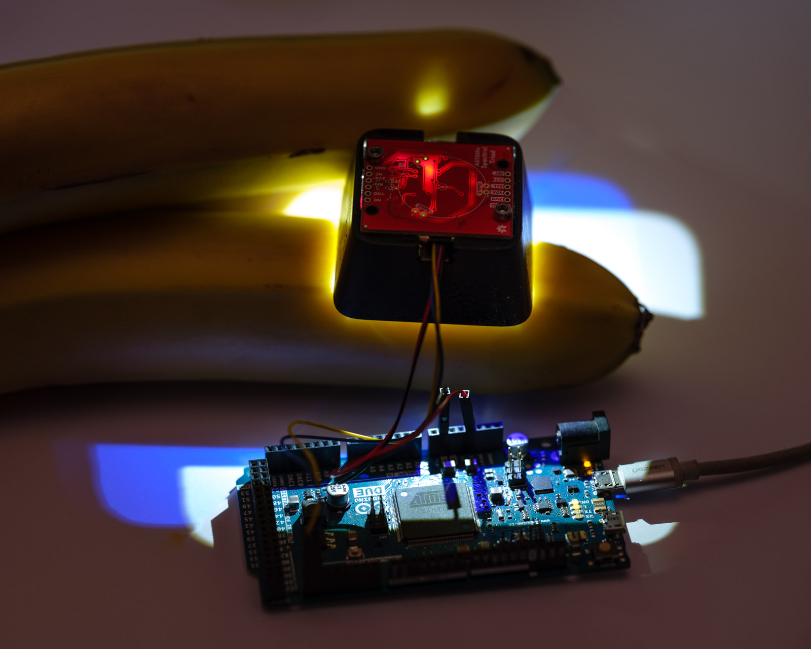
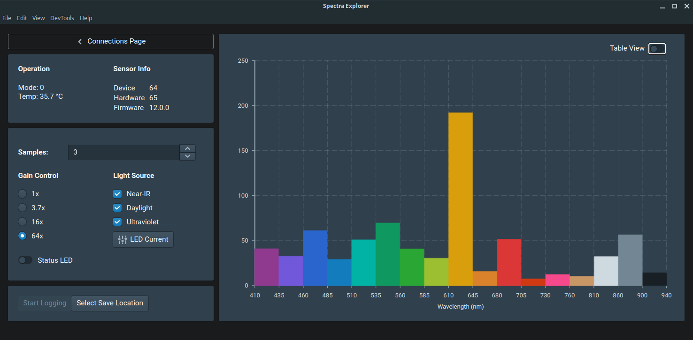

# AS7265x Triad Spectroscopy UI
A simple realtime desktop user interface for playing with the [Sparkfun Triad Spectroscopy](https://www.sparkfun.com/products/15050) sensor.

## Hardware

Works on pretty much any Arduino with I2C support. I used an Arduino Due for bench tests, but ESP32 also tested fine.

Install the `SparkFun_AS7265X.h` library, clicking on the librarymanager link in the Arduino IDE will help fetch it for you.

> Note that the sketch uses a higher than specced I2C clock rate of 1Mhz which worked fine for me, but might need to be dropped to 400kHz or 100kHz if your hardware has issues.

### Modifying the Sparkfun Library

The sensors can sample at nearly 200Hz, but the act of reading out the data to the host microcontroller takes quite a long time (over 400ms for a full 18-channel sample).

The fundamental issue is [this 5ms polling delay](https://github.com/sparkfun/SparkFun_AS7265x_Arduino_Library/blob/ec7fe04a316ff396d0f157bf8f361d0148dc73e4/src/SparkFun_AS7265X.h#L78) which blocks on I2C transactions, increasing the spectral data readout duration substantially.

Change the value to something faster, 100us to 500us by changing the define from `5` to `100`, then doing a find and replace on the `SparkFun_AS7265X.cpp` file, kept in your normal Arduino Library location, i.e. `~/Arduino/libraries/SparkFun_Spectral_Triad_AS7265X/src/SparkFun_AS7265X.cpp`.

Change instances of `delay(AS7265X_POLLING_DELAY)` to `delayMicroseconds(AS7265X_POLLING_DELAY)` throughout the file.

Flash the `firmware/firmware.ino` sketch from this repo to your hardware and connect with the UI.

### Sensor Shroud

A 3D printed sensor shroud/mount is in `/mechanical`, along with exported STEP file in `/mechanical/manufacturing`. 

>  The `as7265x.SLDPRT` was drawn roughly from the part on hand and shouldn't be treated as accurate to the Sparkfun breakout.

## User Interface

Powered by Electric UI. 

To run the UI as a sandbox, ensure you've got the `arc` tooling setup on your computer, your shell is in `/interface` then run

- `arc install` to pull the project deps/etc
- then `arc start` to launch the sandbox.
- `arc build` can be used to generate 'production' bundles for the OS running the build.

